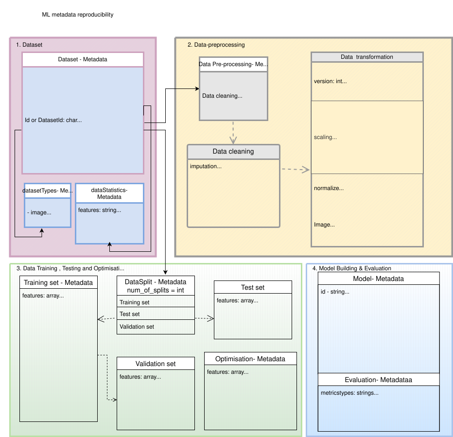
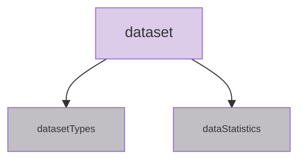

# Insilico protocols for reproducibility of Machine learning(ML)

  
This project aims to define metadata for ML life cycle.
- The schema is prepared by literature review, different checklists, FAIR4ML vocabulary, CrossiantML for dataset, DOME recommendations and also algined with MLSchema. 

```mermaid
graph TD
  ML_metadata[ML_metadata] --> Experiment_Documentation[Experiment_Documentation]
  ML_metadata --> Code[Code]
  ML_metadata --> Dataset[Dataset]
  ML_metadata --> Data_preprocessing[Data_preprocessing]
  ML_metadata --> DataTraining&Testing[DataTraining&Testing]
  ML_metadata --> Optimization[Optimization]
  ML_metadata --> ModelBuilding[ModelBuilding]
  ML_metadata --> ModelEvaluation[ModelEvaluation]

  style ML_metadata fill:#be9dbe,stroke:#333,stroke-width:2px,font-size:30px;
  style Experiment_Documentation fill:#d3d3d3,stroke:#000,stroke-width:1px,font-size:25px;
  style Code fill:#d3d3d3,stroke:#000,stroke-width:1px,font-size:25px;
  style Dataset fill:#d3d3d3,stroke:#000,stroke-width:1px,font-size:25px;
  style Data_preprocessing fill:#d3d3d3,stroke:#000,stroke-width:1px,font-size:25px;
  style DataTraining&Testing fill:#d3d3d3,stroke:#000,stroke-width:1px,font-size:25px;
  style Optimization fill:#d3d3d3,stroke:#000,stroke-width:1px,font-size:25px;
  style ModelBuilding fill:#d3d3d3,stroke:#000,stroke-width:1px,font-size:25px;
  style ModelEvaluation fill:#d3d3d3,stroke:#000,stroke-width:1px, font-size:25px
```

The schema contains subcategories such as Expermentation documentation, Data, Code, Data preprocessing, Data training and testing, Model buidling, Optimization and Evaluation.

This schema helps you to define important metadata needed while setting up your ML experiments. 

 
All the categories under ML experiment is described with the associated metadata and its description below.

1. <b> Experiment Documentation </b>

    -  Experiment ID : Unique identifier for the experiment.  
    -  Experiment Name : A short, descriptive name.  
    -  Date Started : Date when the experiment started.  
    -  Date Ended : Date when the experiment ended.  
    -  Objective : The goal or purpose of the experiment.  
    -  Reproducibility : A flag or status indicating whether the experiment is reproducible.

2. <b>Dataset </b>
    -  Dataset Name : The name of the dataset used.  
    -  Dataset ID : A unique identifier for the dataset.  
    -  Version : The version of the dataset used in the experiment.   
    -  Data Source : The origin of the dataset (e.g., Kaggle, OpenML).  
    - datasetTypes: image, audio, text, tabular data, etc,
    - dataStatistics: fetaures, distributionType
    - conditionsOfAccess: Text
    - isAccessibleForFree: Boolean
    - license: URL 

 

3. <b>Data Preprocessing Metadata</b>
    - Data cleaning: removing special characters, Handling NaNs, removing duplicates
    - Data sampling: simple, random, systemic, cluster sampling methods, data segment, augment and resize for image datasets.
    - Data transformation: scaling, normalization, etc.
    - Data reduction: removing irrelavant features, dimensionality reduction

4. <b>Data Training & Testing Metadata</b>
    - Data split: number of splits, test_size (float/int), train_size(float/int)
    - random_state: Pass an int for reproducible output across multiple function calls
    - Training set: removing special characters, Handling NaNs, removing duplicates
    - Test set: test dataset
    - Validation set: dataset used to evaluate the model during training
    - shuffle: Whether or not to shuffle the data before splitting.
    - stratify Splitting:
    - Cross-validation:  Cross-validation (e.g., k-fold) provides more robust performance estimates.
    - Training Epochs : The number of training epochs or iterations.  
    - Batch Size : The batch size used during training.  
    - Learning Rate : The learning rate used during training.  
    - train_loss: training loss
    - val_loss: validation loss
    

5. <b>Optimization Metadata </b>
    -  Optimizer : The optimizer used (e.g., Adam, SGD).  
    - Model hyperparameters: determining the right combination of hyperparameters that maximizes the model performance.
    - Regularization : Methods used to prevent overfitting (e.g., dropout, L2 regularization).
    - Learning Rate : The learning rate used during training.
    - Loss Function : The function used to evaluate the performance (e.g., cross-entropy, MSE)
    - Training epocs: track training duration
    - gradient norm: Monitors gradient size to detect issues like vanishing/exploding gradients.
    - Metrics: Accuracy, precision, recall, F1 score, etc., tracked on training/validation sets.

6. <b>Model Metadata</b>
    - Model Name : The name or identifier of the ML model.  
    - Model Architecture : Detailed structure or type of the model (e.g., CNN, LSTM, Random Forest).  
    - Model Hyperparameters : Hyperparameters and configuration settings (e.g., learning rate, batch size).  
    - Pre-trained Weights : Whether pre-trained weights were used or not.  
    - Model Version : Version number of the model being used (if applicable).
    - Training Algorithm : The algorithm used for training the model (e.g., SGD, Adam).   
    - classifier: Algorithm classifier
    - Feature Importance: Ranked impact of features (BMI, income, age).
    - TrainingFramework - TensorFlow, PyTorch, sklearn, etc
    - fromFraworkVersion - version of used library.
    - interoperability: transparent, black-box
    - explainibility: feature importance (SHAP or similar methods)

7. <b>Evaluation Metadata </b>
    -  Performance Metrics : Metrics used to evaluate the model's performance (e.g., accuracy, F1 score, AUC).  
    -  Validation : Cross-validation or hold-out method used.  
    -  Benchmarking : Results compared to a baseline or other established models.

8. <b> Reproducibility Metadata </b>
    -  Random Seed : The seed value for random number generation.  
    -  Reproducibility Steps : A list of steps required to ensure the experiment is reproducible.  
    -  Experiment Code : A reference or link to the code used for the experiment.  
    -  Data Access : How the data can be accessed or shared.  
    -  Version Control : Tools and systems used for version control (e.g., Git).  
    -  Logs : Logs of the experiment, including training history, error logs, etc.  
    -  Reproducibility Status : Information on whether the experiment's results have been successfully reproduced by others.

9. <b> Documentation </b>
    -  Experiment Report : A detailed report of the experiment, including the setup, configuration, and results.  
    -  Protocol Documentation : Documentation on the experimental protocol followed, such as hyperparameter tuning, training details, and data preprocessing steps.  
    -  Known Issues : Any issues that might affect reproducibility (e.g., hardware limitations, code bugs).  
    -  Sharing Policy : Licensing, citation, and sharing instructions for the experiment.

