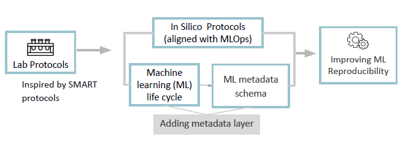
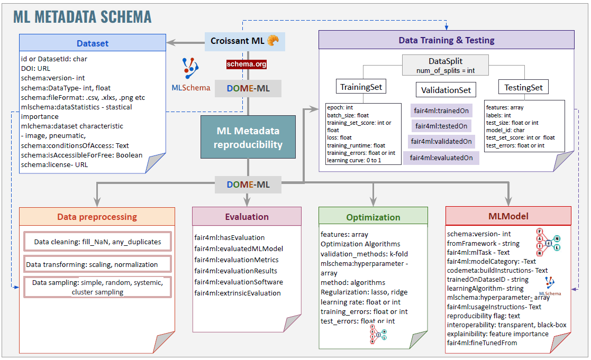
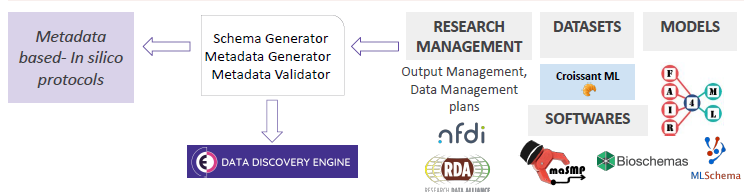

## Semantic approaches for ML experiments

Semantic representations for ML experiments are still new. Recent efforts by [ML Commons](https://mlcommons.org/) provide a representation based on schema.org for datasets used in ML experiments, namely [Croissant ML](https://github.com/mlcommons/croissant). 

On its side, the [RDA FAIR4ML Interest Group](https://www.rd-alliance.org/groups/fair-machine-learning-fair4ml-ig/) has been working on an extension of schema.org to present ML models, vr 0.0.1 was released in 2024-06-04 and is available at [FAIR4ML for ML models](https://w3id.org/fair4ml). This version was created based on [crosswalks](https://github.com/RDA-FAIR4ML/FAIR4ML-crosswalks), mostly done during a hackathon organized at [ZB MED](https://zbmed.de/en/) in November 2023, as part of the activities of the [NFDI4DataScience consortium](https://www.nfdi4datascience.de/). This RDA group is also working on FAIRness for ML and FAIR elements associated with the ML life cycle. 

### Conceptulization

### Initial ML metadata schema 

Note: Detailed documentation of the classes and properties are explained in more detail in our repository, see [ML Metadata page](ML_metadata.md). 

### Future steps

We are currently working in improving our schema so it becomes more integrated and more semantic. In the future, we would like to integrate the deployment steps into our schema. 

